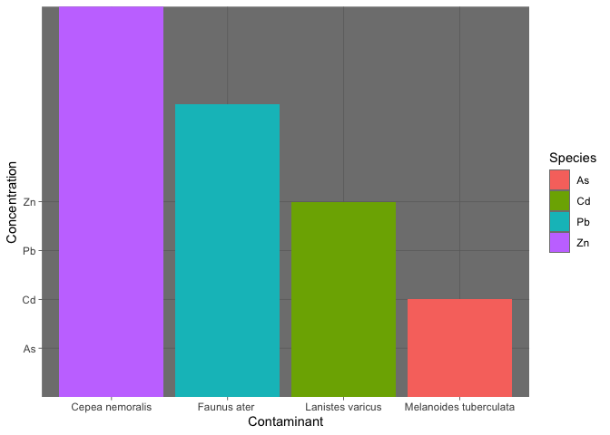
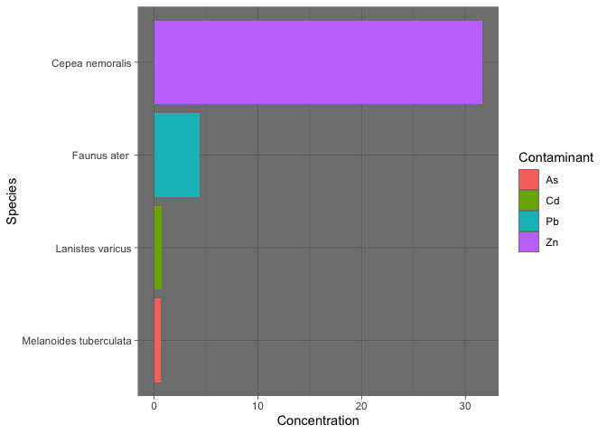

hw\_07
================
Trystan A. Bordeau
10/6/2020

###### 

Homework 7: Bad Plot and Good Plot
==================================

###### 

First we must download the ggplot package so we can use the package to make plots
=================================================================================

``` r
library(ggplot2)
```

Next, we must read in the .csv file that we will be using and assign it to a variable
=====================================================================================

``` r
read.csv("bad_plot.csv")
```

    ##                  Species Contaminant Concentration
    ## 1           Faunus ater           Pb         2.260
    ## 2           Faunus ater           Pb         2.160
    ## 3        Cepea nemoralis          Zn        15.130
    ## 4        Cepea nemoralis          Zn        16.520
    ## 5 Melanoides tuberculata          As         0.524
    ## 6 Melanoides tuberculata          As         0.096
    ## 7       Lanistes varicus          Cd         0.510
    ## 8       Lanistes varicus          Cd         0.212

``` r
bad_plot <- read.csv("bad_plot.csv")
```

Next, lets create the badplot using ggplot() and aes() functions
================================================================

``` r
a <- ggplot(data = bad_plot, aes(x = reorder(Species, bad_plot$Contaminant), y = bad_plot$Contaminant, fill = bad_plot$Contaminant)) + geom_bar(stat = "identity") + theme_dark() + xlab("Contaminant") + ylab("Concentration")
a + guides(fill = guide_legend(title = "Species"))
```

    ## Warning in mean.default(X[[i]], ...): argument is not numeric or logical:
    ## returning NA

    ## Warning in mean.default(X[[i]], ...): argument is not numeric or logical:
    ## returning NA

    ## Warning in mean.default(X[[i]], ...): argument is not numeric or logical:
    ## returning NA

    ## Warning in mean.default(X[[i]], ...): argument is not numeric or logical:
    ## returning NA

    ## Warning in mean.default(X[[i]], ...): argument is not numeric or logical:
    ## returning NA

    ## Warning in mean.default(X[[i]], ...): argument is not numeric or logical:
    ## returning NA

    ## Warning in mean.default(X[[i]], ...): argument is not numeric or logical:
    ## returning NA

    ## Warning in mean.default(X[[i]], ...): argument is not numeric or logical:
    ## returning NA

    ## Warning: Use of `bad_plot$Contaminant` is discouraged. Use `Contaminant`
    ## instead.

    ## Warning: Use of `bad_plot$Contaminant` is discouraged. Use `Contaminant`
    ## instead.

    ## Warning: Use of `bad_plot$Contaminant` is discouraged. Use `Contaminant`
    ## instead.



Lets try to make this even worse! We will use more functions (such as the theme function)
=========================================================================================

``` r
a + theme(axis.text.y = element_text(face = "bold.italic", size = 6))
```

    ## Warning in mean.default(X[[i]], ...): argument is not numeric or logical:
    ## returning NA

    ## Warning in mean.default(X[[i]], ...): argument is not numeric or logical:
    ## returning NA

    ## Warning in mean.default(X[[i]], ...): argument is not numeric or logical:
    ## returning NA

    ## Warning in mean.default(X[[i]], ...): argument is not numeric or logical:
    ## returning NA

    ## Warning in mean.default(X[[i]], ...): argument is not numeric or logical:
    ## returning NA

    ## Warning in mean.default(X[[i]], ...): argument is not numeric or logical:
    ## returning NA

    ## Warning in mean.default(X[[i]], ...): argument is not numeric or logical:
    ## returning NA

    ## Warning in mean.default(X[[i]], ...): argument is not numeric or logical:
    ## returning NA

    ## Warning: Use of `bad_plot$Contaminant` is discouraged. Use `Contaminant`
    ## instead.

    ## Warning: Use of `bad_plot$Contaminant` is discouraged. Use `Contaminant`
    ## instead.

    ## Warning: Use of `bad_plot$Contaminant` is discouraged. Use `Contaminant`
    ## instead.


``` r
a + theme(axis.text.x = element_text(face = "bold.italic", size = 20))
```

    ## Warning in mean.default(X[[i]], ...): argument is not numeric or logical:
    ## returning NA

    ## Warning in mean.default(X[[i]], ...): argument is not numeric or logical:
    ## returning NA

    ## Warning in mean.default(X[[i]], ...): argument is not numeric or logical:
    ## returning NA

    ## Warning in mean.default(X[[i]], ...): argument is not numeric or logical:
    ## returning NA

    ## Warning in mean.default(X[[i]], ...): argument is not numeric or logical:
    ## returning NA

    ## Warning in mean.default(X[[i]], ...): argument is not numeric or logical:
    ## returning NA

    ## Warning in mean.default(X[[i]], ...): argument is not numeric or logical:
    ## returning NA

    ## Warning in mean.default(X[[i]], ...): argument is not numeric or logical:
    ## returning NA

    ## Warning: Use of `bad_plot$Contaminant` is discouraged. Use `Contaminant`
    ## instead.

    ## Warning: Use of `bad_plot$Contaminant` is discouraged. Use `Contaminant`
    ## instead.

    ## Warning: Use of `bad_plot$Contaminant` is discouraged. Use `Contaminant`
    ## instead.

 \# This is a bad plot for many reasons. The axis titles are completely wrong and do not match what is being shown on the graph, the names of the species are far too big to see, and the data is not actually portrayed in any sort of meaningful way. Additionally, the color scheme is absolutely disgusting and is not appealing on a black background.

###### 

Good Plot: Now lets create a plot that actually portrays good information
=========================================================================

###### 

``` r
a <- ggplot(data = bad_plot, aes(x = reorder(bad_plot$Species, bad_plot$Concentration), y = bad_plot$Concentration, fill = bad_plot$Contaminant)) + geom_bar(stat = "identity") + theme_dark() + coord_flip() + xlab("Species") + ylab("Concentration")
a + guides(fill = guide_legend(title = "Contaminant"))
```

    ## Warning: Use of `bad_plot$Species` is discouraged. Use `Species` instead.

    ## Warning: Use of `bad_plot$Concentration` is discouraged. Use `Concentration`
    ## instead.

    ## Warning: Use of `bad_plot$Concentration` is discouraged. Use `Concentration`
    ## instead.

    ## Warning: Use of `bad_plot$Contaminant` is discouraged. Use `Contaminant`
    ## instead.

 \# This plot is good becuase it clearly shows the concentrations, species, and contaminant of choice in the plot. The lines are clearly shown and are not squished together. The Contaminants are nicely filled within the bars and have a nice color scheme.
