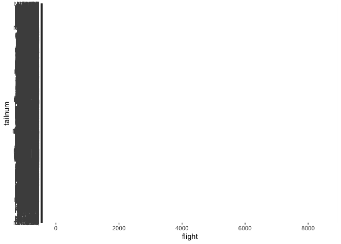

hw\_08
================
Trystan A. Bordeau
10/17/2020

Homework 8: More Data Wrangling
===============================

Lists, data frames, and vectors
===============================

We must first call in the packages that we will be using

``` r
library(tidyverse)
```

    ## ── Attaching packages ────────────────────────────────────────────────────────────────────────────────────────────────── tidyverse 1.3.0 ──

    ## ✓ ggplot2 3.3.2     ✓ purrr   0.3.4
    ## ✓ tibble  3.0.3     ✓ dplyr   1.0.2
    ## ✓ tidyr   1.1.2     ✓ stringr 1.4.0
    ## ✓ readr   1.3.1     ✓ forcats 0.5.0

    ## ── Conflicts ───────────────────────────────────────────────────────────────────────────────────────────────────── tidyverse_conflicts() ──
    ## x dplyr::filter() masks stats::filter()
    ## x dplyr::lag()    masks stats::lag()

``` r
library(nycflights13)
```

Next, lets create a list (using the list() function) to call three named elements. I will be using mtcars, diamonds, and letters as my three elements

``` r
my_list <- list(data_frame_1 = mtcars, 
                data_frame_2 = diamonds, 
                data_frame_3 = letters)
```

Now lets access the first element by name using $

``` r
my_list$data_frame_1
```

    ##                      mpg cyl  disp  hp drat    wt  qsec vs am gear carb
    ## Mazda RX4           21.0   6 160.0 110 3.90 2.620 16.46  0  1    4    4
    ## Mazda RX4 Wag       21.0   6 160.0 110 3.90 2.875 17.02  0  1    4    4
    ## Datsun 710          22.8   4 108.0  93 3.85 2.320 18.61  1  1    4    1
    ## Hornet 4 Drive      21.4   6 258.0 110 3.08 3.215 19.44  1  0    3    1
    ## Hornet Sportabout   18.7   8 360.0 175 3.15 3.440 17.02  0  0    3    2
    ## Valiant             18.1   6 225.0 105 2.76 3.460 20.22  1  0    3    1
    ## Duster 360          14.3   8 360.0 245 3.21 3.570 15.84  0  0    3    4
    ## Merc 240D           24.4   4 146.7  62 3.69 3.190 20.00  1  0    4    2
    ## Merc 230            22.8   4 140.8  95 3.92 3.150 22.90  1  0    4    2
    ## Merc 280            19.2   6 167.6 123 3.92 3.440 18.30  1  0    4    4
    ## Merc 280C           17.8   6 167.6 123 3.92 3.440 18.90  1  0    4    4
    ## Merc 450SE          16.4   8 275.8 180 3.07 4.070 17.40  0  0    3    3
    ## Merc 450SL          17.3   8 275.8 180 3.07 3.730 17.60  0  0    3    3
    ## Merc 450SLC         15.2   8 275.8 180 3.07 3.780 18.00  0  0    3    3
    ## Cadillac Fleetwood  10.4   8 472.0 205 2.93 5.250 17.98  0  0    3    4
    ## Lincoln Continental 10.4   8 460.0 215 3.00 5.424 17.82  0  0    3    4
    ## Chrysler Imperial   14.7   8 440.0 230 3.23 5.345 17.42  0  0    3    4
    ## Fiat 128            32.4   4  78.7  66 4.08 2.200 19.47  1  1    4    1
    ## Honda Civic         30.4   4  75.7  52 4.93 1.615 18.52  1  1    4    2
    ## Toyota Corolla      33.9   4  71.1  65 4.22 1.835 19.90  1  1    4    1
    ## Toyota Corona       21.5   4 120.1  97 3.70 2.465 20.01  1  0    3    1
    ## Dodge Challenger    15.5   8 318.0 150 2.76 3.520 16.87  0  0    3    2
    ## AMC Javelin         15.2   8 304.0 150 3.15 3.435 17.30  0  0    3    2
    ## Camaro Z28          13.3   8 350.0 245 3.73 3.840 15.41  0  0    3    4
    ## Pontiac Firebird    19.2   8 400.0 175 3.08 3.845 17.05  0  0    3    2
    ## Fiat X1-9           27.3   4  79.0  66 4.08 1.935 18.90  1  1    4    1
    ## Porsche 914-2       26.0   4 120.3  91 4.43 2.140 16.70  0  1    5    2
    ## Lotus Europa        30.4   4  95.1 113 3.77 1.513 16.90  1  1    5    2
    ## Ford Pantera L      15.8   8 351.0 264 4.22 3.170 14.50  0  1    5    4
    ## Ferrari Dino        19.7   6 145.0 175 3.62 2.770 15.50  0  1    5    6
    ## Maserati Bora       15.0   8 301.0 335 3.54 3.570 14.60  0  1    5    8
    ## Volvo 142E          21.4   4 121.0 109 4.11 2.780 18.60  1  1    4    2

Now lets access the second element using \[\[ \]\] function

``` r
my_list[["data_frame_2"]]
```

    ## # A tibble: 53,940 x 10
    ##    carat cut       color clarity depth table price     x     y     z
    ##    <dbl> <ord>     <ord> <ord>   <dbl> <dbl> <int> <dbl> <dbl> <dbl>
    ##  1 0.23  Ideal     E     SI2      61.5    55   326  3.95  3.98  2.43
    ##  2 0.21  Premium   E     SI1      59.8    61   326  3.89  3.84  2.31
    ##  3 0.23  Good      E     VS1      56.9    65   327  4.05  4.07  2.31
    ##  4 0.290 Premium   I     VS2      62.4    58   334  4.2   4.23  2.63
    ##  5 0.31  Good      J     SI2      63.3    58   335  4.34  4.35  2.75
    ##  6 0.24  Very Good J     VVS2     62.8    57   336  3.94  3.96  2.48
    ##  7 0.24  Very Good I     VVS1     62.3    57   336  3.95  3.98  2.47
    ##  8 0.26  Very Good H     SI1      61.9    55   337  4.07  4.11  2.53
    ##  9 0.22  Fair      E     VS2      65.1    61   337  3.87  3.78  2.49
    ## 10 0.23  Very Good H     VS1      59.4    61   338  4     4.05  2.39
    ## # … with 53,930 more rows

Now lets access the third element as a list using the \[ \] syntax

``` r
my_list["data_frame_3"]
```

    ## $data_frame_3
    ##  [1] "a" "b" "c" "d" "e" "f" "g" "h" "i" "j" "k" "l" "m" "n" "o" "p" "q" "r" "s"
    ## [20] "t" "u" "v" "w" "x" "y" "z"

Using mtcars, access the mpg column in two different ways

``` r
mtcars["mpg"]
```

    ##                      mpg
    ## Mazda RX4           21.0
    ## Mazda RX4 Wag       21.0
    ## Datsun 710          22.8
    ## Hornet 4 Drive      21.4
    ## Hornet Sportabout   18.7
    ## Valiant             18.1
    ## Duster 360          14.3
    ## Merc 240D           24.4
    ## Merc 230            22.8
    ## Merc 280            19.2
    ## Merc 280C           17.8
    ## Merc 450SE          16.4
    ## Merc 450SL          17.3
    ## Merc 450SLC         15.2
    ## Cadillac Fleetwood  10.4
    ## Lincoln Continental 10.4
    ## Chrysler Imperial   14.7
    ## Fiat 128            32.4
    ## Honda Civic         30.4
    ## Toyota Corolla      33.9
    ## Toyota Corona       21.5
    ## Dodge Challenger    15.5
    ## AMC Javelin         15.2
    ## Camaro Z28          13.3
    ## Pontiac Firebird    19.2
    ## Fiat X1-9           27.3
    ## Porsche 914-2       26.0
    ## Lotus Europa        30.4
    ## Ford Pantera L      15.8
    ## Ferrari Dino        19.7
    ## Maserati Bora       15.0
    ## Volvo 142E          21.4

``` r
mtcars %>%
  select(mpg)
```

    ##                      mpg
    ## Mazda RX4           21.0
    ## Mazda RX4 Wag       21.0
    ## Datsun 710          22.8
    ## Hornet 4 Drive      21.4
    ## Hornet Sportabout   18.7
    ## Valiant             18.1
    ## Duster 360          14.3
    ## Merc 240D           24.4
    ## Merc 230            22.8
    ## Merc 280            19.2
    ## Merc 280C           17.8
    ## Merc 450SE          16.4
    ## Merc 450SL          17.3
    ## Merc 450SLC         15.2
    ## Cadillac Fleetwood  10.4
    ## Lincoln Continental 10.4
    ## Chrysler Imperial   14.7
    ## Fiat 128            32.4
    ## Honda Civic         30.4
    ## Toyota Corolla      33.9
    ## Toyota Corona       21.5
    ## Dodge Challenger    15.5
    ## AMC Javelin         15.2
    ## Camaro Z28          13.3
    ## Pontiac Firebird    19.2
    ## Fiat X1-9           27.3
    ## Porsche 914-2       26.0
    ## Lotus Europa        30.4
    ## Ford Pantera L      15.8
    ## Ferrari Dino        19.7
    ## Maserati Bora       15.0
    ## Volvo 142E          21.4

Now, we will create a new column in mtcars that displays displacement per cylinder (engine displacment divided by cylinders)

``` r
mtcars["displacement.per.cylinder"] <- mtcars$disp / mtcars$cyl
```

Now we will create a single column data frame using the mutate() function

``` r
mtcars <- mtcars
disp_cyl <- mtcars %>%
  mutate(disp_cyl = (paste(disp/cyl))) %>%
  select(disp_cyl)
```

Factors
=======

Create a numeric vector (I will use the one given to us in the assignment)

``` r
num.vec <- c(3, 4, 1, 5)
```

use as.factor() to convert the numeric vector to a factor

``` r
factor <- as.factor(num.vec)
```

use as.numeric() to convert that factor to a numeric vector

``` r
as.numeric(factor)
```

    ## [1] 2 3 1 4

Exploratory Data Analysis
=========================

Now, lets use the babynames dataset to do some exploratory data analysis.

First, we must install the babynames package

``` r
library(nycflights13)
library("tidyverse")
library(dplyr)
```

Now, lets write some code and explore the data that we have here!

``` r
?nycflights13::flights
ggplot(data = flights, aes(x = flight, y = tailnum)) 
```


